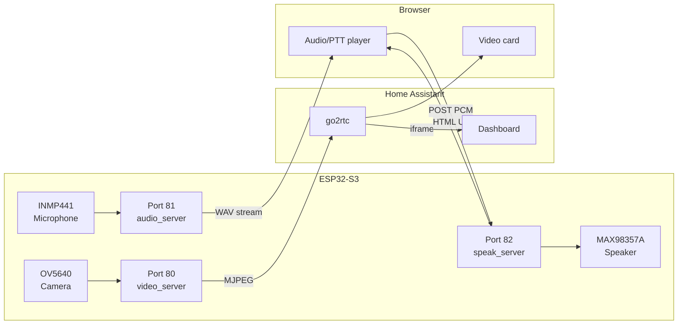

# ESP32-S3 BabyMonitor

A self-hosted baby monitor built on the **Freenove ESP32-S3 WROOM (N16R8)** with full two-way communication — live video, live audio, and push-to-talk — all accessible from a web browser or Home Assistant dashboard.

No cloud. No app. No subscription.

---

## Features

- **Live video** — MJPEG stream over HTTP (port 80), compatible with go2rtc and Home Assistant
- **Live audio** — continuous WAV stream from INMP441 microphone (port 81)
- **Push-to-talk** — hold a button in the browser to speak through the MAX98357A speaker (port 82)
- **mDNS** — access via `http://babymonitor.local` without finding the IP address
- **Home Assistant integration** — embed video via go2rtc and the audio/talk player as dashboard cards

---

## Hardware

| Component | Part | Pins |
|-----------|------|------|
| Microcontroller | Freenove ESP32-S3 WROOM N16R8 | — |
| Camera | OV5640 (built-in) | XCLK=15, SIOD=4, SIOC=5, VSYNC=6, HREF=7, PCLK=13, Y2–Y9=11,9,8,10,12,18,17,16 |
| Microphone | INMP441 (I2S) | SCK=GPIO3, WS=GPIO21, SD=GPIO1 |
| Speaker amplifier | MAX98357A (I2S) | BCLK=GPIO41, LRC=GPIO42, DOUT=GPIO47 |

> **Note:** GPIO14 is defective (stuck HIGH) on the tested board. GPIO3 is used for I2S SCK instead — it is a strapping pin but works reliably as I2S clock after boot.

---

## Wiring

```
INMP441 microphone:
  VDD  → 3.3V
  GND  → GND
  SCK  → GPIO3
  WS   → GPIO21
  SD   → GPIO1
  L/R  → GND  (selects left channel)

MAX98357A speaker amplifier:
  VIN  → 5V
  GND  → GND
  BCLK → GPIO41
  LRC  → GPIO42
  DIN  → GPIO47
```

---

## HTTP Endpoints

| Port | Path | Description |
|------|------|-------------|
| 80 | `/` | Status page with links |
| 80 | `/stream` | MJPEG live video stream |
| 80 | `/capture` | Single JPEG snapshot |
| 81 | `/audio` | WAV audio stream (16kHz, 16-bit mono) |
| 82 | `/player` | Browser UI — listen + push-to-talk |
| 82 | `/speak` | POST endpoint — receives PCM audio, plays on speaker |

---

## Arduino IDE Setup

1. Install **ESP32 board support** (Espressif) in Arduino IDE
2. Select board: `ESP32S3 Dev Module`
3. Settings:
   - Flash: `16MB (128Mb)`
   - Partition Scheme: `Huge APP (3MB No OTA / 1MB SPIFFS)`
   - PSRAM: `OPI PSRAM`
   - USB CDC On Boot: `Disabled`
4. Open `firmware/BabyMonitor.ino`
5. Edit WiFi credentials at the top of the file:
   ```cpp
   static const char* WIFI_SSID = "DITT_WIFI_NAVN";
   static const char* WIFI_PASS = "DITT_WIFI_PASSORD";
   ```
6. Flash via the right USB-C port (CH343 UART)

---

## Browser – Push-to-Talk (getUserMedia over HTTP)

Chrome blocks microphone access on non-HTTPS origins by default. To allow it on your local network:

1. Open: `chrome://flags/#unsafely-treat-insecure-origin-as-secure`
2. Add: `http://babymonitor.local:82`
3. Click **Enable** → **Relaunch**
4. Go to `http://babymonitor.local:82/player`
5. Hold the blue button to speak

---

## Home Assistant Integration

### go2rtc (video)

Add to `/config/go2rtc.yaml`:
```yaml
streams:
  babymonitor_video:
    - ffmpeg:http://babymonitor.local/stream#video=mjpeg
```

### Dashboard cards

**Video card** (Webpage card):
```
http://<your-ha-ip>:11984/stream.html?src=babymonitor_video&mode=mjpeg
```

**Audio/talk card** (Webpage card):
```
http://babymonitor.local:82/player
```

---

## 3D Printed Enclosure

The `hardware/` folder contains a `.3mf` file (Bambu Lab format) for a wall-mounted enclosure designed around the SG90 servo pan mechanism.

**Design concept:** The SG90 servo is fixed to the wall. The bowl-shaped enclosure (containing the ESP32-S3, microphone, and speaker) rotates around the servo horn, giving 180° horizontal pan.

**Print settings used:**
| Setting | Value |
|---------|-------|
| Printer | Bambu Lab |
| Filament | PLA |
| Layer height | 0.2 mm |
| Infill | 15% |
| Supports | No |

**Assembly notes:**
- Glue the SG90 plastic horn wings to the bottom of the bowl
- Mount the servo body to the wall — the enclosure rotates around it
- Route cables (USB-C power, speaker wires) with enough slack for full 180° rotation
- SG90 requires a **separate 5V power supply** — the ESP32-S3 board's 5V pin only delivers ~4.1V which is insufficient

> The `.3mf` file opens in Bambu Studio and most modern slicers (PrusaSlicer, OrcaSlicer).

---

## Architecture

Three separate HTTP servers are required because `esp_http_server` is single-threaded. The MJPEG stream handler on port 80 holds the connection permanently — if `/player` were also on port 80, it would never receive a response.

```
Port 80  — video_server  — /stream (blocking MJPEG), /capture, /
Port 81  — audio_server  — /audio  (blocking WAV stream)
Port 82  — speak_server  — /player (HTML UI), /speak (POST PCM → speaker)
```



---

## Latency

| Stream | Typical delay |
|--------|--------------|
| Video (MJPEG via go2rtc) | 1–3 seconds |
| Audio (WAV stream in browser) | ~0.5 seconds |
| Push-to-talk (browser → speaker) | ~0.3 seconds |

MJPEG latency is dominated by go2rtc buffering. Direct MJPEG (`http://babymonitor.local/stream`) is faster but not embeddable in HA dashboards without go2rtc.

---

## Known Limitations

This is a hobby and educational project. Be aware of the following before deploying it:

- **No encryption** — all streams are plain HTTP on the local network
- **No authentication** — anyone on the same WiFi can access the video, audio, and speaker
- **MJPEG is bandwidth-heavy** — not suitable for remote access over mobile data
- **No acoustic echo cancellation (AEC)** — you will hear yourself if audio is playing while you push to talk
- **Not a certified product** — not suitable as a sole safety device for infants

---

## Tested With

| Component | Version |
|-----------|---------|
| Home Assistant OS | 2026.4.0 |
| go2rtc (built into HA) | 1.9.x |
| Arduino IDE | 2.x |
| ESP32 Arduino core | 3.x |
| Chrome | 134+ |

---

## Background

This project was developed as part of a Home Assistant and IoT course at a Norwegian vocational college. It is shared openly because there is very little documentation on combining real-time audio streaming, push-to-talk, and MJPEG video on a single ESP32-S3 using only the Arduino framework and standard HTTP servers.

If you find it useful or build on it — great!

---

## Credits

Built by **Bård Kjellhov-Reinton**, teacher at Fagskolen i Viken avd. Kongsberg, as part of a Home Assistant and IoT course. Developed together with Claude (Anthropic) through an iterative process of building, hitting walls, and figuring it out.

## License

MIT
